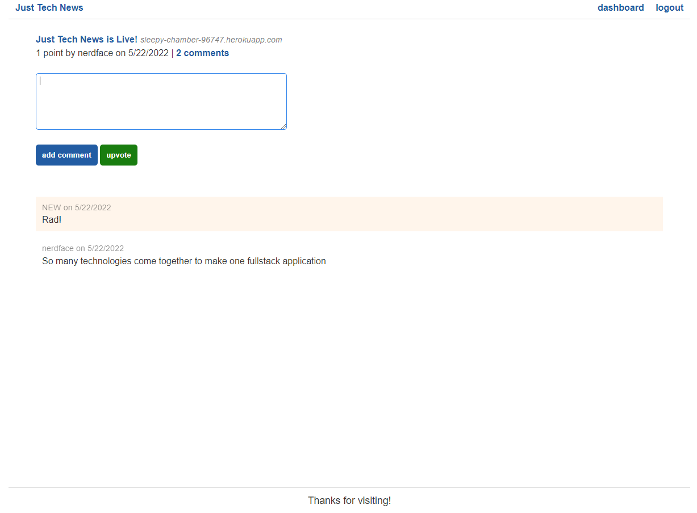

  # Just Tech News
  
  Just Tech News is a full-stack web application that allows users to make, comment, and vote on community-generated posts. This application uses a model-view-controller framework to handle data. Users are able to create and login to personal accounts, create, edit, and delete posts + upvote and comment on posts. The application on the front end uses HTML, CSS, and JavaScript. On the backend, data is managed using MySQL and sequelize (passwords are protected using bcrypt). Node.js and Express.js handle API requests.
  
  ## Table of Contents
  
  * [Installation](#installation)
  * [Built Using](#built)
  * [Usage Information](#usage)
  * [Authors & Acknowledgements](#credits)
  * [Tests](#tests)
  * [Contact](#questions)
  
  ## Installation 
  After cloning the repository, enter "npm i" into the terminal to install all dependencies and enter "npm start" to run the application. For local use, please create a .env file with "DB_NAME", "USER", and "PASSWORD" variables.

  ## Built Using 
  * HTML
  * CSS
  * JavaScript
  * Node.js
  * MySQL
  * Sequelize
  * Express.js
  * bcrypt
  * npm dotenv
  * npm mysql2
  * npm express-sessions
  * npm connect-session-sequelize
  * Handlebars
  * Jest
  * Insomnia
  * Heroku
  
  ## Usage Information
  [Just Tech News](https://sleepy-chamber-96747.herokuapp.com/) 
    
  This application hosts a forum for community-generated posts. 
    
  
  ## Authors & Acknowledgements
  
  Base code © 2020 - 2022 Trilogy Education Services, a 2U, Inc. brand. All Rights Reserved.
  
  Made by [TOVTC](https://github.com/TOVTC).

  ## Tests
  Jest tests were written for validating formatting.
  
  ## Questions?
  Contact repository author via [GitHub](https://github.com/TOVTC). 
    